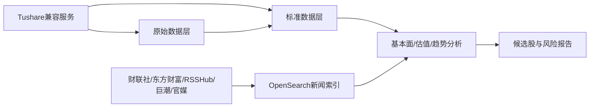
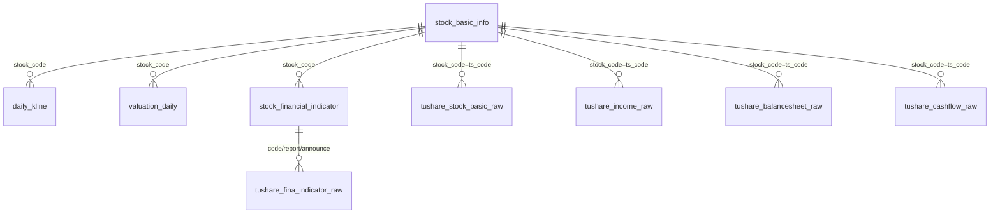

# 当前金融数据模型与来源说明

更新时间：2026-08-02

本文只描述当前实际启用、已接入或作为分析主模型使用的数据。不列出尚未启用、依赖QMT/MiniQMT且当前为空的QMT专用表。

## 1. 当前系统总览



当前分工：

| 数据域 | 存储 | 主要来源 | 用途 |
|---|---|---|---|
| 股票基础信息 | PostgreSQL | Tushare `stock_basic` | 股票代码、名称、市场、上市状态 |
| 日线行情 | PostgreSQL | Tushare `daily` | K线、均线、趋势、成交量 |
| 估值快照 | PostgreSQL | Tushare `daily_basic` | PE、PB、PS、市值、换手率 |
| 复权因子 | 已建立 raw 表并正在初始化 | Tushare `adj_factor` | 前复权/后复权计算 |
| 财务指标 | PostgreSQL | Tushare `fina_indicator` | ROE、资产负债率、现金流质量 |
| 三大财务报表 | PostgreSQL原始层 | Tushare `income`、`balancesheet`、`cashflow` | 财务核验、重算指标 |
| 新闻、政策、监管 | OpenSearch | RSS、RSSHub、AkShare、网页/API | 信息发现和交叉验证 |
| 公司公告 | OpenSearch | 巨潮 `cninfo` | 官方公告、年报、风险核验 |

## 2. PostgreSQL标准表

### 2.1 `stock_basic_info`：股票基础信息

来源：Tushare `stock_basic`。

主键：`stock_code`。

| 字段 | 类型 | 含义 |
|---|---|---|
| `stock_code` | varchar | Tushare格式证券代码，例如 `000001.SZ` |
| `symbol` | varchar | 六位股票代码，例如 `000001` |
| `name` | text | 股票名称，可能包含ST、退市标记 |
| `area` | text | 所在地区；源数据为空时为NULL |
| `industry` | text | 行业分类；源数据为空时为NULL |
| `market` | text | 市场板块，如主板、创业板、科创板、北交所 |
| `list_date` | date | 首次上市日期，不是当前交易日期 |
| `delist_date` | date | 退市日期，未退市时为空 |
| `list_status` | varchar | 上市状态：L上市、D退市、P暂停上市等 |
| `source` | varchar | 数据来源，当前为 `tushare` |
| `fetched_at` | timestamp | 本次抓取时间 |

注意：退市股票的`list_date`可能非常早，这是源数据的真实首次上市日期，不是异常值。

### 2.2 `daily_kline`：股票日线行情

来源：Tushare `daily`。

主键：`(stock_code, trade_date)`。

| 字段 | 类型 | 含义 |
|---|---|---|
| `stock_code` | varchar | 证券代码 |
| `trade_date` | date | 交易日期 |
| `open` | double | 开盘价 |
| `high` | double | 最高价 |
| `low` | double | 最低价 |
| `close` | double | 收盘价 |
| `volume` | double | 成交量，已将Tushare的手转换为股：`vol * 100` |
| `amount` | double | 成交额，已将Tushare的千元转换为元：`amount * 1000` |

价格是Tushare `daily`的原始日线价格，不应直接当作前复权价格。复权分析应使用复权因子计算派生价格。

### 2.3 `valuation_daily`：每日估值快照

来源：Tushare `daily_basic`。

主键：`(stock_code, trade_date, source)`。

| 字段 | 类型 | 含义 |
|---|---|---|
| `stock_code` | varchar | 证券代码 |
| `trade_date` | date | 估值所属交易日 |
| `turnover_rate` | double | 换手率 |
| `pe` | double | 市盈率；具体口径以接口字段说明为准 |
| `pe_ttm` | double | TTM市盈率 |
| `pb` | double | 市净率 |
| `ps` | double | 市销率 |
| `ps_ttm` | double | TTM市销率 |
| `dv_ratio` | double | 股息率 |
| `total_mv` | double | 总市值，按Tushare原始单位保存 |
| `circ_mv` | double | 流通市值，按Tushare原始单位保存 |
| `source` | varchar | 当前为 `tushare` |
| `fetched_at` | timestamp | 抓取时间 |

该表与`daily_kline`通过`stock_code + trade_date`关联，但估值不是行情字段，不能混入日线表。

### 2.4 `stock_financial_indicator`：统一财务指标

来源：Tushare `fina_indicator`。

主键：`(stock_code, report_date, announce_date, source)`。

| 字段 | 类型 | 含义 |
|---|---|---|
| `stock_code` | varchar | 证券代码 |
| `report_date` | date | 报告期，来自Tushare `end_date` |
| `announce_date` | date | 公告日，来自Tushare `ann_date` |
| `roe` | double | 净资产收益率 |
| `roa` | double | 总资产收益率 |
| `debt_to_assets` | double | 资产负债率 |
| `grossprofit_margin` | double | 毛利率 |
| `netprofit_margin` | double | 净利率 |
| `ocf_to_or` | double | 经营现金流/营业收入 |
| `revenue_yoy` | double | 营业收入同比增长率 |
| `netprofit_yoy` | double | 净利润同比增长率 |
| `eps` | double | 每股收益 |
| `bps` | double | 每股净资产 |
| `source` | varchar | 当前为 `tushare` |
| `fetched_at` | timestamp | 抓取时间 |

核心规则：历史分析只能使用`announce_date <= trade_date`的数据，不能用报告期代替公告日。

### 2.5 财务指标字段的来源关系

| 标准字段 | 主要接口字段 |
|---|---|
| `roe` | `fina_indicator.roe` |
| `roa` | `fina_indicator.roa` |
| `debt_to_assets` | `fina_indicator.debt_to_assets` |
| `grossprofit_margin` | `fina_indicator.grossprofit_margin` |
| `netprofit_margin` | `fina_indicator.netprofit_margin` |
| `ocf_to_or` | `fina_indicator.ocf_to_or` |
| `eps` | `fina_indicator.eps` |
| `bps` | `fina_indicator.bps` |
| `revenue_yoy` | `fina_indicator`或由`income`计算 |
| `netprofit_yoy` | `fina_indicator`或由`income`计算 |

## 3. Tushare原始数据表

原始表的作用是：保留接口原貌、支持问题排查、支持重新转换标准表。策略层不直接读取原始JSON。

### 3.1 `tushare_stock_basic_raw`

来源：Tushare `stock_basic`。

| 字段 | 含义 |
|---|---|
| `ts_code` | 原始Tushare证券代码，主键 |
| `payload` | 完整原始记录JSONB |
| `fetched_at` | 原始记录抓取时间 |

### 3.2 `tushare_fina_indicator_raw`

来源：Tushare `fina_indicator`。

| 字段 | 含义 |
|---|---|
| `ts_code` | 证券代码 |
| `ann_date` | 原始公告日 |
| `end_date` | 原始报告期 |
| `payload` | 完整原始指标JSONB |
| `fetched_at` | 抓取时间 |

主键：`(ts_code, ann_date, end_date)`。

### 3.3 `tushare_income_raw`

来源：Tushare `income`，保存利润表原始JSON。

主要用途：营业收入、营业利润、净利润、每股收益等财务核验和重新计算。

### 3.4 `tushare_balancesheet_raw`

来源：Tushare `balancesheet`，保存资产负债表原始JSON。

主要用途：总资产、总负债、股东权益、应收账款、存货、商誉等风险分析。

### 3.5 `tushare_cashflow_raw`

来源：Tushare `cashflow`，保存现金流量表原始JSON。

主要用途：经营活动现金流、投资活动现金流、融资活动现金流和现金变化分析。

这三张原始表共同使用：

```text
(ts_code, ann_date, end_date)
```

作为股票、公告日和报告期的关联键。

## 4. 交易日历

来源：Tushare `trade_cal`。

当前主要作为任务运行时接口使用，负责判断：

- 指定日期是否为交易日
- 日线是否应该采集
- 历史补数需要处理哪些交易日

当前已建立交易日历持久化表，同时保留原始表用于重算和审计：

```text
trading_calendar(exchange, cal_date, is_open, pretrade_date)
```

## 5. 新闻与公告数据模型

新闻不存入上述PostgreSQL表，而是写入OpenSearch年度索引：

```text
news-YYYY
```

当前索引文档主要字段：

| 字段 | 含义 |
|---|---|
| `title` | 新闻或公告标题 |
| `content` | 正文或摘要 |
| `pub_time` | 发布时间 |
| `fetch_time` | 抓取时间 |
| `source` | 来源标识，如`cninfo`、`cls`、`em_report_strategy` |
| `channel` | `announcement`、`policy`、`media`、`report`、`flash`等 |
| `stocks` | 已识别的关联股票列表 |
| `url` | 原始链接 |
| `vec_status` | 向量处理状态 |

主要来源：

| 来源标识 | 来源 |
|---|---|
| `cninfo` | 巨潮公司公告 |
| `cls` | 财联社快讯 |
| `em` | 东方财富快讯 |
| `govcn_policy`、`govcn_gwy` | 中国政府网 |
| `ndrc`、`gov_bmwj` | 发改委/政策文件 |
| `csrc`、`mof`、`szse_notice` | 监管部门/交易所 |
| `em_report_strategy` | 东方财富策略研报 |
| `em_report_industry` | 东方财富行业研报 |
| `em_report_macro` | 东方财富宏观研报 |
| `cctv` | 新闻联播 |
| `caixin`、`thepaper`、`guancha`等 | RSSHub媒体源 |

OpenSearch中的公告和新闻用于：

```text
候选股基本面筛选后的公告核验
监管处罚和风险事件识别
行业政策和宏观环境判断
研报中的行业格局与上下游信息提取
```

## 6. 表之间的关联关系



逻辑上的时间关联为：

```text
stock_basic_info.stock_code
        +
daily_kline.trade_date
        +
valuation_daily.trade_date
        +
stock_financial_indicator.announce_date <= trade_date
```

这样可以回答：某个交易日当时已知的财务质量、估值和趋势是什么。

## 7. 当前数据流

### 日线和估值

```text
Tushare stock_basic
        ↓
stock_basic_info
        ↓
Tushare daily(trade_date)
        ↓
daily_kline
        ↓
Tushare daily_basic(trade_date)
        ↓
valuation_daily
```

### 财务数据

```text
Tushare fina_indicator
        ├── tushare_fina_indicator_raw
        └── stock_financial_indicator

Tushare income
        └── tushare_income_raw

Tushare balancesheet
        └── tushare_balancesheet_raw

Tushare cashflow
        └── tushare_cashflow_raw
```

### 最终分析

```text
stock_financial_indicator
    → ROE/负债率/现金流过滤

valuation_daily
    → PE/PB/市值/换手率过滤

daily_kline
    → 均线/成交量/趋势/突破判断

OpenSearch news-*
    → 公告/政策/监管/研报交叉验证

以上结果
    → 候选股票、风险说明、止损价和仓位计算
```

## 8. 当前明确不属于主模型的内容

以下是QMT/MiniQMT相关的空表或未启用能力，当前不作为主数据模型：

- QMT实时行情
- Tick逐笔数据
- Level-2盘口
- QMT分钟线
- QMT专用财务字段表
- QMT交易下单接口

短期所有研究数据以Tushare为主；未来若接入其他来源，只需实现相同的标准化层，不应让策略层直接依赖新来源字段。

## 9. 数据质量和使用规则

1. Tushare原始数据保留在`*_raw`表，标准表保存清洗后的可分析字段。
2. 空值使用SQL `NULL`，不能把字符串`'NaN'`当作真实业务值。
3. 日线成交量已转换为股，成交额已转换为元。
4. `list_date`是首次上市日期，`delist_date`是退市日期。
5. 财务分析必须区分报告期和公告日。
6. 严格回测必须使用`announce_date <= trade_date`。
7. 原始行情、前复权行情和后复权行情不能混为一谈。
8. Tushare和其他行情源不能无标记地混写同一标准记录。
9. 接口权限不足时必须记录失败，不能把空结果当作零值写入。

## 10. 当前状态总结

```text
Tushare股票基础信息       已接入并落库
Tushare日线行情           已接入并落库
Tushare每日估值           已接入并落库
Tushare财务指标           已接入并落库
Tushare三大报表原始层     已接入并落库
Tushare基础信息原始层     已接入并落库
新闻/政策/监管/公告       OpenSearch已接入
QMT/MiniQMT               当前不启用
```

## 11. 完整性审计与后续补充

截至本文更新时间，模型文档与数据库结构一致，但以下项目属于“已规划、尚未完整落地”，不能误认为已经完成：

| 项目 | 当前状态 | 影响 |
|---|---|---|
| 复权因子 `adj_factor` | raw 表和标准表已建立，raw 初始化正在补齐 | 完成初始化后可用于严格复权收益分析 |
| `trade_cal`持久化 | raw 表和标准表已建立 | 已支持离线审计和任务重放 |
| 财务全市场覆盖 | 四张财务 Raw 已按 5,874 只股票完成历史初始化，三张报表 Standard 正在全量同步 | Standard 全量质量验收和 PIT 完成前，不直接用于正式历史筛选 |
| `revenue_yoy`、`netprofit_yoy` | 标准表已预留，但当前指标请求未完整填充 | 后续需增加接口字段或由利润表计算 |
| 三大报表标准层 | 三张 Standard 表结构已建立，已完成样本验证，正式全量同步进行中 | 全量质量验收前，策略暂不直接依赖全部财务字段 |
| PE/PB历史分位 | 已有每日估值快照，尚未形成分位计算任务 | 还不能直接输出“历史20%/30%分位”结论 |
| 日线历史完整性 | 五年行情 Raw/Standard 已完成历史转换；每日增量按最近 5 个交易日回补 | 仍需完成增量修正验证和最终质量报告 |

因此，当前模型已经足以作为“数据仓库主模型”，但还没有达到“全市场完整选股生产库”的状态。后续生产化顺序应为：

1. 增加交易日历表和复权因子表。
2. 按交易日批量补齐日线历史窗口。
3. 按股票和报告期批量补齐全市场财务原始层及标准指标层。
4. 从`valuation_daily`计算滚动PE/PB历史分位。
5. 把利润表和现金流量表中策略需要的字段标准化，避免策略直接解析JSONB。
6. 增加数据完整性检查：股票覆盖率、交易日覆盖率、公告日缺失率、重复率和空值率。
### 11.1 原始市场数据表（新增）

为保证接口异常、字段映射错误或标准模型调整后可以离线重算，行情类数据统一采用 raw 原始层加标准层双层保存。新增迁移文件为 `sql/014_create_tushare_market_raw.sql`。

#### `tushare_daily_raw`

来源：Tushare `daily`。主键为 `ts_code + trade_date + source`。`payload` 完整保存该股票该交易日的原始 JSON；标准化后写入 `daily_kline`。原始 `vol` 单位为手，标准表转换为股；原始 `amount` 单位为千元，标准表转换为元。

#### `tushare_daily_basic_raw`

来源：Tushare `daily_basic`。主键为 `ts_code + trade_date + source`。保存换手率、PE、PB、PS、市值等完整接口返回字段；标准化后写入 `valuation_daily`。

#### `tushare_adj_factor_raw`

来源：Tushare `adj_factor`。主键为 `ts_code + trade_date + source`。保存原始复权因子；标准化后写入 `adj_factor_daily`，用于计算前复权或后复权价格，不覆盖 `daily_kline` 的原始价格。

#### `tushare_trade_cal_raw`

来源：Tushare `trade_cal`。主键为 `exchange + cal_date + source`。保存交易所、开闭市状态和前一交易日等原始字段；标准化后写入 `trading_calendar`。

四张表共同字段：`payload` 为完整 JSONB 原文，`source` 为来源标识，`fetched_at` 为抓取时间。标准表发生字段变更时，优先从 raw 表重新转换，不重新请求 Tushare。

### 11.2 当前完整数据链路

```text
Tushare daily          -> tushare_daily_raw          -> daily_kline
Tushare daily_basic    -> tushare_daily_basic_raw    -> valuation_daily
Tushare adj_factor     -> tushare_adj_factor_raw     -> adj_factor_daily
Tushare trade_cal      -> tushare_trade_cal_raw      -> trading_calendar
Tushare fina_indicator -> tushare_fina_indicator_raw -> stock_financial_indicator
Tushare income         -> tushare_income_raw
Tushare balancesheet   -> tushare_balancesheet_raw
Tushare cashflow       -> tushare_cashflow_raw
```

历史初始化和每日同步必须先落 raw，再生成标准表。`tushare_history_init.py` 当前默认 raw-only；标准化转换应独立执行。断点记录在 `tushare_history_checkpoint`，相关索引由 `sql/015_tushare_indexes.sql` 建立。
## 12. 每日增量与 Raw 版本层

新增 `tushare_market_raw_version`，保存 `daily`、`daily_basic`、`adj_factor`、`trade_cal` 每次成功抓取的完整 JSON、业务键、批次号、抓取时间和 SHA-256。现有 `*_raw` 表只做首次业务记录的幂等追加，不更新或删除历史记录。

每日任务 `data_collect/jobs/tushare_daily_incremental.py` 默认回补最近 5 个交易日：先写 Raw 版本，再重建对应日期的 Standard，并核对 Raw 最新版本行数与 Standard 行数。重复运行允许生成新抓取版本，但不会产生重复 Standard 主键。
## 13. 财务报表 Standard 设计冻结

三张财务报表保持独立事实表：

```text
tushare_income_raw       -> financial_income_standard
tushare_balancesheet_raw -> financial_balance_sheet_standard
tushare_cashflow_raw     -> financial_cash_flow_standard
```

`financial_income_standard` 用于收入、营业利润、净利润和 EPS；`financial_balance_sheet_standard` 用于资产负债率、现金、应收、存货、商誉和债务风险；`financial_cash_flow_standard` 用于经营现金流、投资现金流、融资现金流、资本开支和现金质量。

三张表均需保留 `stock_code`、`report_date`、`announce_date`、`f_ann_date`、`report_type`、`comp_type`、`end_type`、`update_flag`、`source`、`record_version`、`quality_status` 和 `fetched_at`。金额、股数、比例等字段必须明确单位；第一版只标准化核心分析字段，未映射字段继续保留在 Raw。

财务数据必须先经过不可变 Raw 版本层。PIT 生成 `effective_announce_date`：优先使用 `f_ann_date`，为空时使用 `ann_date`；两个原始日期都必须保留。Standard 保留所有报表口径和修订版本，研究默认筛选合并报表，不能按报告期直接覆盖旧记录。

历史记录：三张财务报表 Raw、财务 Raw 版本表和三张 Standard 表结构已建立；当前实际进度和阶段二新增对象见本文末尾的“阶段二新增模型”与 `dev_doc/phase2_implementation.md`。

## 14. 阶段二新增模型（2026-08-04）

以下为当前代码和迁移中的最新阶段二对象；Raw 只追加、不更新、不删除，Standard/PIT/Feature 可从 Raw/Standard 重建：

| 来源接口 | Raw 表（原始事实） | 派生表（用途） |
|---|---|---|
| `stock_st` | `tushare_stock_st_raw`：历史 ST/风险状态 | `std.security_status_daily`：每日状态 |
| `suspend_d` | `tushare_suspend_d_raw`：停复牌事件 | `std.security_status_daily`、`pit.security_tradeability_daily`：可交易判断 |
| `stk_limit` | `tushare_stk_limit_raw`：每日涨跌停价格 | 同上：买卖限制判断 |
| `namechange` | `tushare_namechange_raw`：名称变更区间 | `std.security_lifecycle`：历史名称/生命周期 |
| `dividend` | `tushare_dividend_raw`：分红送转原始事件 | `std.dividend_event`、`feature.shareholder_return_v1` |
| `index_daily` | `tushare_index_daily_raw`：指数日线 | `std.index_daily_tushare`：基准和超额收益 |

阶段二 PIT/Feature：

- `pit.universe_daily`：按历史日期还原研究范围，保留退市股票，不使用当前幸存者名单替代历史集合。
- `pit.security_tradeability_daily`：按停牌、价格和涨跌停区分可交易、可买、可卖；ST 是风险状态，不自动等同于不可交易。
- `pit.financial_asof`：只使用 `effective_announce_date <= decision_date` 的财务记录；当前财务指标 Standard 未提供的 `f_ann_date` 等字段保持 NULL，不伪造。
- `feature.price_daily_v1`、`feature.valuation_daily_v1`、`feature.company_financial_v1`、`feature.shareholder_return_v1`：分别提供价格趋势、估值分位、财务质量和股东回报特征，均记录质量状态和来源日期。

阶段二当前进度以 `dev_doc/phase2_implementation.md` 和 `dev_doc/agent_tasks.md` 为准；旧的阶段一状态描述仅作历史记录，不代表当前进度。
